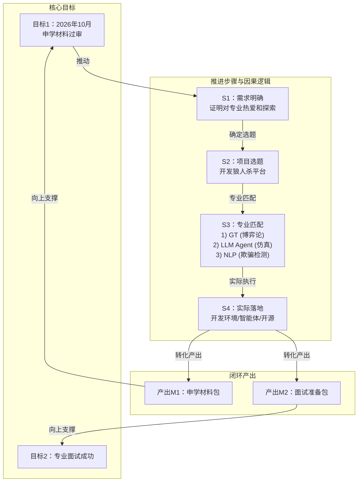

# 2027年被香港大学本科CS专业AI方向录取 —— 因果链

```mermaid
flowchart TD
    subgraph 核心目标
        T1["目标1：2026年10月<br/>申学材料过审"]
        T2["目标2：专业面试成功"]
    end

    subgraph 推进步骤与因果逻辑
        S1["S1：需求明确<br/>证明对专业热爱和探索"]
        S2["S2：项目选题<br/>开发狼人杀平台"]
        S3["S3：专业匹配<br/>1) GT (博弈论)<br/>2) LLM Agent (仿真)<br/>3) NLP (欺骗检测)"]
        S4["S4：实际落地<br/>开发环境/智能体/开源"]
    end

    subgraph 闭环产出
        M1["产出M1：申学材料包"]
        M2["产出M2：面试准备包"]
    end

    %% 因果流动链
    T1 -->|推动| S1
    S1 -->|确定选题| S2
    S2 -->|专业匹配| S3
    S3 -->|实际执行| S4
    
    %% 产出转化链
    S4 -->|转化产出| M1
    S4 -->|转化产出| M2
    
    %% 向上支撑闭环
    M1 -->|向上支撑| T1
    M2 -->|向上支撑| T2
```

