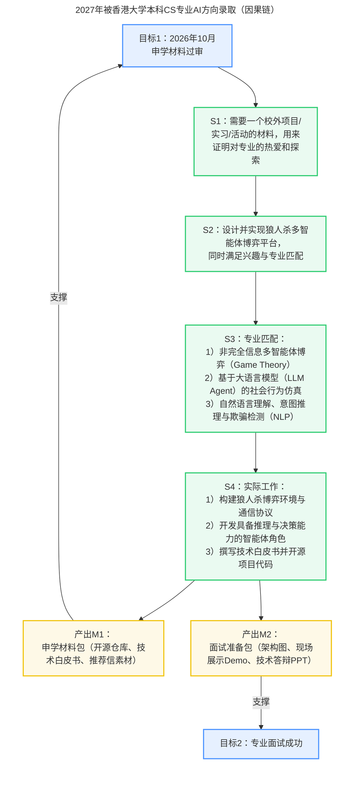

```mermaid
graph TD
    %% 标题与核心主题
    subgraph Title ["2027年被香港大学本科CS专业AI方向录取（因果链）"]
        direction TB
        
        %% 节点定义
        Obj1["目标1：2026年10月<br>申学材料过审"]
        Obj2["目标2：专业面试成功"]
        
        S1["S1：需要一个校外项目/<br>实习/活动的材料，用来<br>证明对专业的热爱和探<br>索"]
        S2["S2：设计并实现狼人杀多智能体博弈平台，<br>同时满足兴趣与专业匹配"]
        S3["S3：专业匹配：<br>1）非完全信息多智能体博弈（Game Theory）<br>2）基于大语言模型（LLM Agent）的社会行为仿真<br>3）自然语言理解、意图推理与欺骗检测（NLP）"]
        S4["S4：实际工作：<br>1）构建狼人杀博弈环境与通信协议<br>2）开发具备推理与决策能力的智能体角色<br>3）撰写技术白皮书并开源项目代码"]
        
        M1["产出M1：<br>申学材料包（开源仓库、技术白皮书、推荐信素材）"]
        M2["产出M2：<br>面试准备包（架构图、现场展示Demo、技术答辩PPT）"]
    end

    %% 流程连接线
    Obj1 --> S1
    S1 --> S2
    S2 --> S3
    S3 --> S4
    S4 --> M1
    S4 --> M2
    
    %% 支撑关系连接线
    M1 -->|支撑| Obj1
    M2 -->|支撑| Obj2

    %% 样式调整（高对比度蓝绿色系）
    style Obj1 fill:#e6f0ff,stroke:#4d94ff,stroke-width:2px;
    style Obj2 fill:#e6f0ff,stroke:#4d94ff,stroke-width:2px;
    style S1 fill:#eafaf1,stroke:#2ecc71,stroke-width:2px;
    style S2 fill:#eafaf1,stroke:#2ecc71,stroke-width:2px;
    style S3 fill:#eafaf1,stroke:#2ecc71,stroke-width:2px;
    style S4 fill:#eafaf1,stroke:#2ecc71,stroke-width:2px;
    style M1 fill:#fef9e7,stroke:#f1c40f,stroke-width:2px;
    style M2 fill:#fef9e7,stroke:#f1c40f,stroke-width:2px;
    style Title fill:none,stroke:none;
```